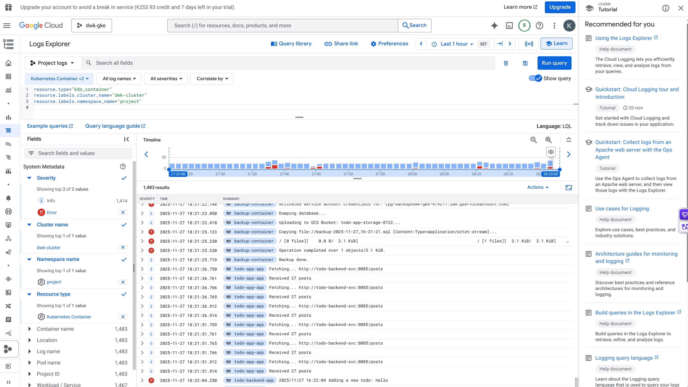

# Todo app

> NOTE: All kubernetes files moved to <https://github.com/kirillstrelkov/todo-app-gitops>
> Only ArgoCD deployments are tested.

## DBaaS vs DIY

| feature       | DBaaS                                                                                                   | DIY                                                                                                                                                                                               |
| ------------- | ------------------------------------------------------------------------------------------------------- | ------------------------------------------------------------------------------------------------------------------------------------------------------------------------------------------------- |
| work required | Most of work is done by provider.                                                                       | Everything(db installation, network setup, db configuration) should be done manually with Compute instances                                                                                       |
| costs         | DBaaS usufally higher then compute.                                                                     | Compute is cheaper DBaaS but hours should be spent for initial setup and constant maintenance.                                                                                                    |
| backup        | Simple configuration via provider. Backups might increase costs for storage.                            | Whole back up setup should be done manually. Backup storage is cheaper then DBaaS but all maintenance should be done manually.                                                                    |
| maintenance   | Patching and updates done automatically by provider. Scaling, monitoring is easy and done via provider. | Patching and updates should be done manually. Horizontal and vertical scaling might require new servers or new architecture. Monitoring is done by internal team and it should be 24/7 available. |
| ease of use   | Most of thing can be done via provider's web UI.                                                        | Big work should be spent on infrastucture setup, implementation and maintenance.                                                                                                                  |
| security      | Cloud provider can have advisor and quick check to improve secutiry                                     | Security should be taken in account from the start for everything db access, secure networking and backups.                                                                                       |

DBaaS - use when there is no dedicated team/capacity to own infrastucture and ideal starting point for startups/prototyping.

DIY - use in production when there is enough resources to full own database configuration

## Deploy to k3d cluster

1. Build, import and deploy `make`

NOTE: create cluster with `k3d cluster create --port 8082:30080@agent:0 -p 8081:80@loadbalancer --agents 2`
NOTE 2: make folder in agent0 `docker exec k3d-k3s-default-agent-0 mkdir -p /tmp/todoapp`

## postgresql

```bash
DB_URL=postgresql://<username>:<password>@172.17.0.2:5432/pingpongdb?sslmode=disable
```

Replace `username` and `password` with proper values

## Work with encrypted yaml

If new `key.txt` is created, `manifests/deployment.yaml` should be created from `manifests/enc/deployment.yaml` but with proper `value` for `DB_URL`

```bash
sops --encrypt \
	--age $(grep '# public key:' ../key.txt | cut -d ':' -f 2 | tr -d ' ') \
	--encrypted-regex '(Data)$' \
	./manifests/secrets.yaml > ./manifests/enc/secrets.yaml
```

## Deploy to GKE

Check gke/README.md.

1. Build images and deploy to GKE `make docker-build`
2. Use `make gke` to apply all manifests

NOTE: `pg-backup` image should be push manually, check `./Makefile`

`google-service-account-key` secret should be available in cluster:

```bash
kubectl create secret generic google-service-account-key --from-file=<path to json key file>
```

### View logs in GKE

Open `Logs explorer` and use query:

```
resource.type="k8s_container"
resource.labels.cluster_name="dwk-cluster"
resource.labels.namespace_name="project"
```

Example:


## Prometheus

Check [../monitoring/README.md](../monitoring/README.md)

## NATS

Install NATS

```bash
make install-nats
```

### In order to view via Grafana

1. Label nats service monitor resource so it will be available via prometheus

   ```bash
   make label-nats-metrics
   ```

2. Login to grafana web app
3. Create dashboard with <https://raw.githubusercontent.com/nats-io/prometheus-nats-exporter/5084a32850823b59069f21f3a7dde7e488fef1c6/walkthrough/grafana-nats-dash.json>

## ArgoCD applications

In order to deploy 2 applications - staging and production:

```bash
make argocd
```
